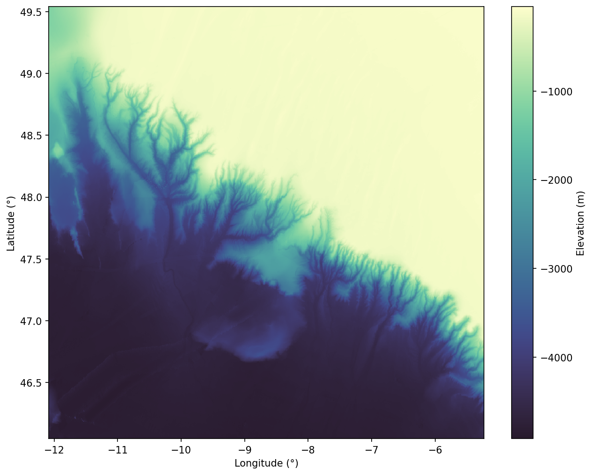
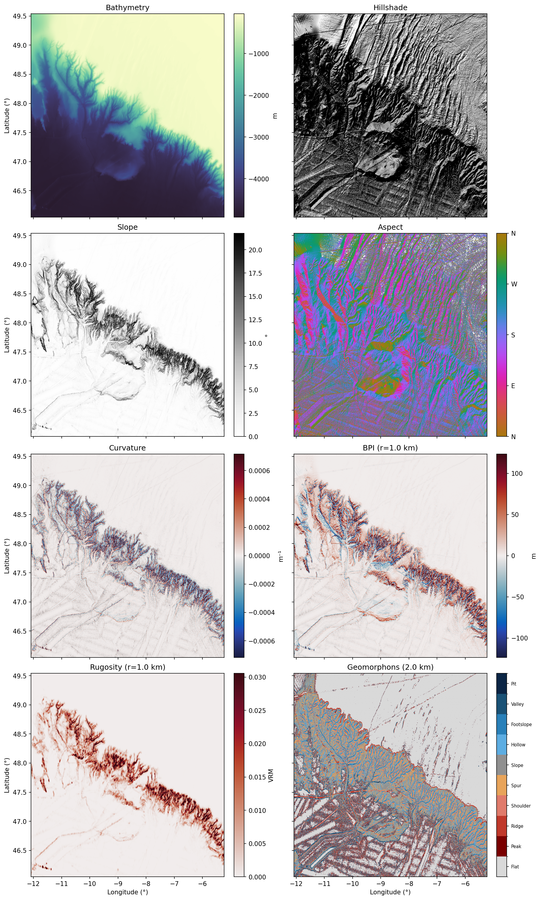
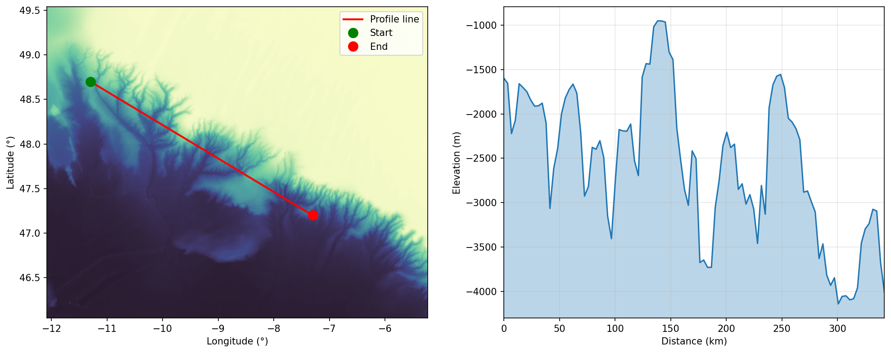
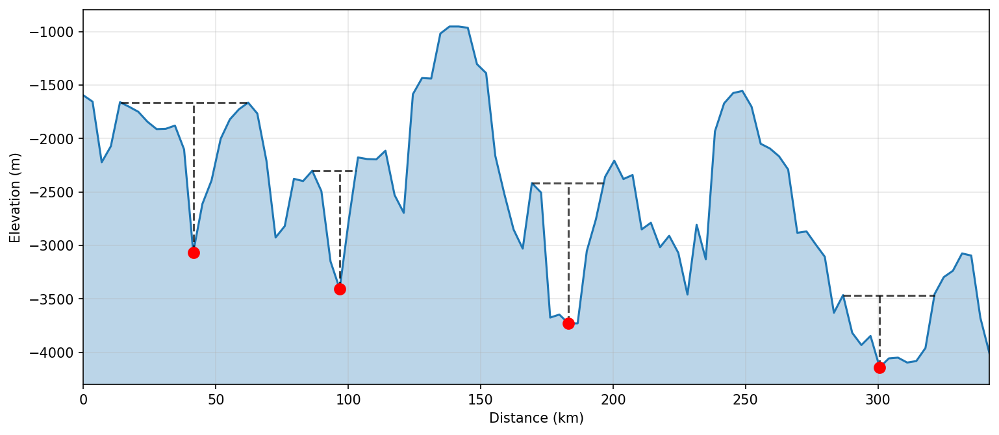

# 🌐 bathy

*from Greek βαθύς (bathýs) — deep*


[](https://github.com/eslrgs/bathy/actions/workflows/ci.yml)
[](https://eslrgs.github.io/bathy)

[](LICENSE)

Bathymetric analysis and visualisation in Python.

**[Documentation](https://eslrgs.github.io/bathy)** · [Installation](#installation) · [Features](#features) · [Examples](#examples)

## Motivation

I found creating bathymetric plots and profiles in Python surprisingly difficult. `bathy` provides a simple, high-level interface for loading, analysing, and visualising bathymetry data, so you can go from raw grid to reproducible quantitative analysis to finished figure with minimal effort.

## Basic usage

### Load data

```python
import bathy

# Load from file
data = bathy.load_bathymetry("GEBCO_2025.nc", lon_range=(-10, 0), lat_range=(50, 60))

# Or download GEBCO data via OPeNDAP
data = bathy.load_gebco_opendap(lon_range=(-10, 0), lat_range=(50, 60))
```

### Visualise

```python
bathy.plot_bathy(data)
```

<p align="center">
  
</p>

### Analysis overview

```python
bathy.plot_overview(data)
```

<p align="center">
  
</p>

### Profiles and canyon analysis

```python
prof = bathy.extract_profile(data, (-11.3, 48.7), (-7.3, 47.2), name="Along-slope")
bathy.plot_profile(prof, show_map=True, bathymetry_data=data)
```

<p align="center">
  
</p>

```python
canyons = bathy.get_canyons(prof, prominence=100)
bathy.plot_canyons(prof, canyons)
```

<p align="center">
  
</p>

## Installation

```bash
# From GitHub
uv pip install git+https://github.com/eslrgs/bathy.git

# Or from a local clone
git clone https://github.com/eslrgs/bathy.git
cd bathy
uv pip install .
```

## Features

| Category | Description |
|---|---|
| **IO** | Load from local files (NetCDF, GeoTIFF), GEBCO OPeNDAP, or EMODnet WCS. Export to GeoTIFF. 28 preset regions included. |
| **Analysis** | Slope, aspect, curvature, rugosity, BPI, geomorphons, contours, smoothing, hypsometric analysis |
| **Plotting** | Publication-ready bathymetry, hillshade, slope, aspect, overview, 3D surface, depth zones, histograms, interactive maps |
| **Profiles** | Extract profiles between points, generate cross-sections, load from file or GeoDataFrame |
| **Profile analysis** | Statistics, gradient, concavity, knickpoints, canyon detection, comparison across profiles |
| **Draw** | Interactive PyQt6 desktop tool for drawing and editing profiles with drag, undo, and waypoint editing |

See the [full API reference](https://eslrgs.github.io/bathy) for details.

## Examples

See [examples/basic_usage.ipynb](examples/basic_usage.ipynb), [examples/profiles.ipynb](examples/profiles.ipynb), and [examples/draw_profile.py](examples/draw_profile.py).

### Profile drawing

Draw profiles interactively in a PyQt6 desktop window. Requires `uv pip install bathy[draw]`.

```bash
uv run bathy-draw path/to/data.nc
```

- Left-click to add waypoints, right-click to finish a profile, double-click to stop
- Drag waypoints to reposition, press **z** to undo, shift-click to delete
- Save/load profiles as GeoPackage, toggle visibility per profile

## Development

```bash
git clone https://github.com/eslrgs/bathy.git
cd bathy
uv sync
pre-commit install
```

```bash
just format  # Format and lint
just test    # Run tests
```

## Use of AI

This project was developed with assistance from AI, which was used for code generation, documentation, and testing.

## License

MIT License - see [LICENSE](LICENSE) for details.
